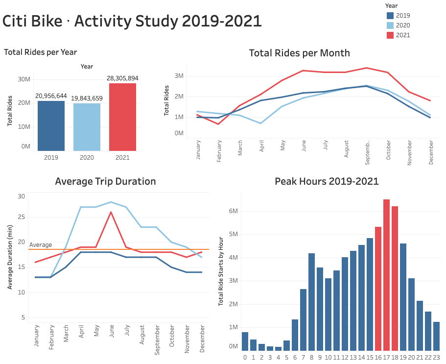
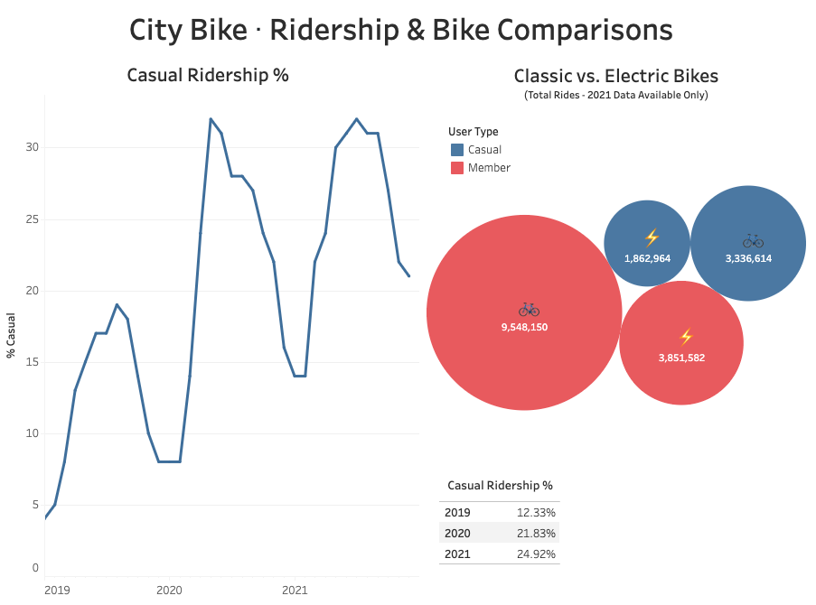

# Citi Bike Study

Prepared by Corey Lawson-Enos

## Summary
* Tableau visualizations that study New York's Citi Bike bicycle share program's ride datasets, years 2019 through 2021. A detailed station map with month/year ticker animates total starts and stops at each station to show increases and decreases in station activity over the course of the three years.

* Questions asked and charted include:
  - Which periods were most active for the entire program? 
  - Which stations are most/least active?
  - How has ridership changed over the three-year period? 
  - Is the introduction of electric bikes impacting ridership?

## Access
* Visit: https://public.tableau.com/app/profile/corey.lawson.enos/viz/citi-bike-challenge/CitiBikeStudy?publish=yes
* twbx Tableau file also available for download from this repository.

## Analysis
* Summary ride counts point to the pandemic's short-term impact on the program, with an observable dip in 2020. A sizable increase for both casual and member ridership followed in 2021, with numbers much higher than pre-pandemic levels, suggesting that perhaps bicycle ride-sharing may now be considered by many to be a safer form of transportation than crowded bus or subway.
* Avergage ride duration noticeably increased during the height of the pandemic, suggesting riders were willing to bike longer distances to avoid bus/subway. A spike in duration is observable in the summer of 2021 as well, when the Delta variant surged. Increase is also shown when the Omicron variant began to spread late 2021.
* Comparing monthly ride totals between the three years shows roughly parallel arc that appears to be seasonal in nature, with overall ridership increasing in summer months, decreasing in winter.  
* As might be anticipated, the pandemic's shelter-in-place period of April 2020 reflects the program's lowest activity point. See also the April 2020 station map tick (snapshot below).
* The program's casual ridership doubled from 2019 to 2021, pandemic notwithstanding. Pandemic health/safety considerations may be a significant factor, but the larger convenience of electric bikes, the program's overall expansion, and marketing to the tourism industry should all be considered as possible or added factors as well.
* Classic/electric bike data is available after February 2021 only, but numbers already show that electric rides are widely popular. 40% of the membership chose electric during the eleven months' worth of available data, as did a significant 55% of casual riders. A link between the availability of electric bikes and increased casual ridership may be observed.

## Technologies
Tableau, Pandas

## Dashboard Preview

## Station Map Preview

## Sources

* ![Citi Bike System Data] (https://ride.citibikenyc.com/system-data)
* Metropolitan New York and Jersey City datasets for 2019-2021 downloaded, cleaned, and summarized in Pandas.
* The summary csv tables exported from Pandas are saved in this repository's Data folder for inspection.

## Contact
E-mail: clawson131@gmail.com 
LinkedIn: https://www.linkedin.com/in/corey-lawson-enos/
